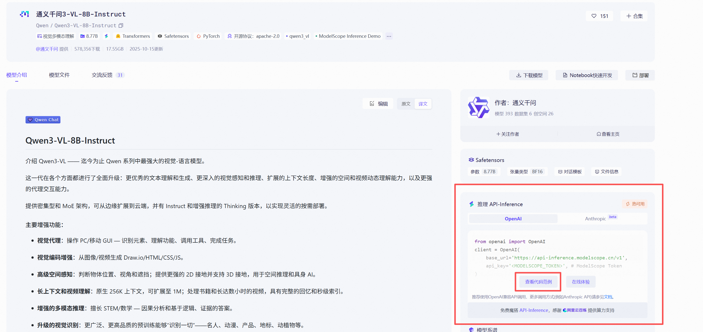
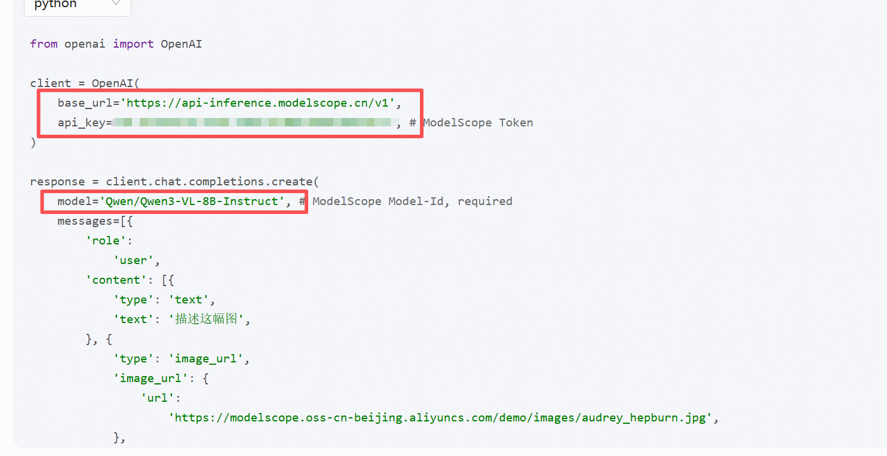
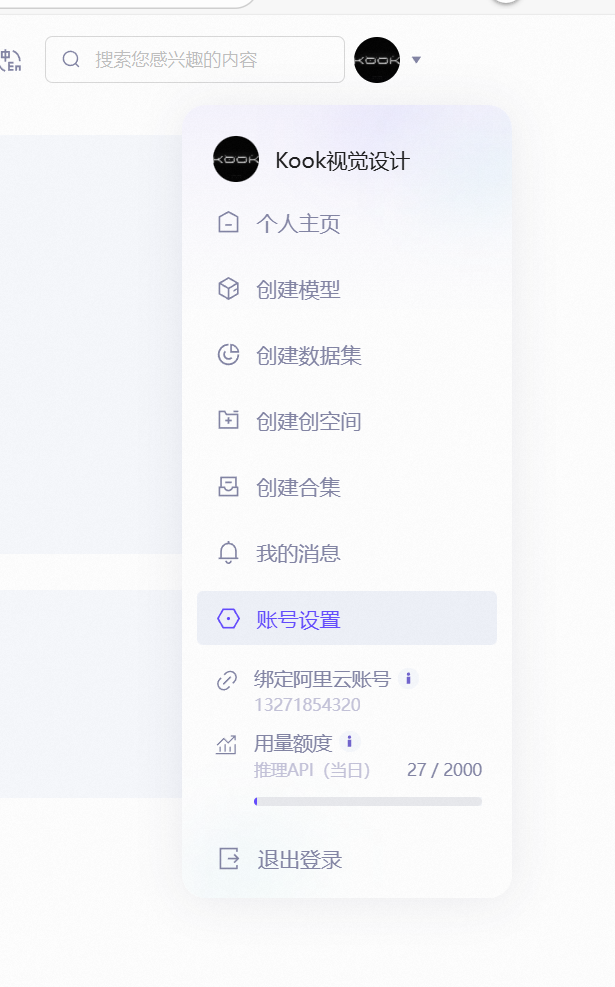
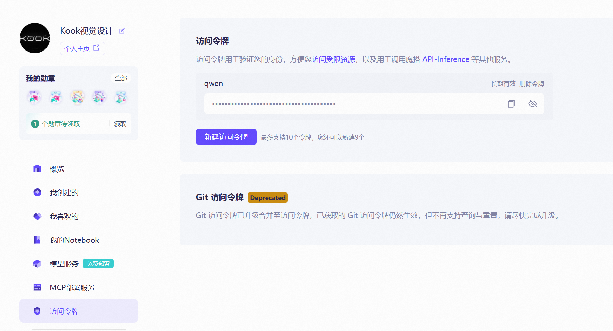

# 魔搭API调用反推节点

一个基于魔搭(ModelScope)视觉语言模型的ComfyUI自定义节点，支持图片描述、视觉问答等功能。

## 功能特性

- 支持自定义API地址(base_url)
- 支持自定义API密钥(api_key)
- 支持自定义提示文本(text)
- 支持自定义模型(model)
- 输入：图片
- 输出：文本

## 安装方法

导航到您的 ComfyUI 自定义节点目录： cd ComfyUI/custom_nodes
克隆此仓库： git clone https://github.com/KookYn9404/ComfyUI_ModelScope-API-Inference.git
重启 ComfyUI
直接搜索魔搭API就能看到

## 参数说明

| 参数名 | 类型 | 默认值 | 说明 |
|--------|------|--------|------|
| image | IMAGE | - | 输入的图片 |
| base_url | STRING | https://api-inference.modelscope.cn/v1 | 魔搭API地址 |
| api_key | STRING | - | ModelScope Token |
| text | STRING | 描述这幅图 | 自定义提示文本 |
| model | STRING | Qwen/Qwen3-VL-8B-Instruct | 模型名称 |

## 使用示例

1. 在ComfyUI中搜索"魔搭API调用反推节点"节点
2. 连接图片输入
3. 填写API密钥和自定义提示
  
  
5. 运行节点，获取文本输出

## 模型支持

支持ModelScope上的视觉语言模型，如：
- Qwen/Qwen3-VL-8B-Instruct
- Qwen/Qwen3-VL-72B-Instruct
- ZhipuAI/GLM-4.6V-Flash
- 等其他兼容OpenAI Vision API格式的模型

## 获取ModelScope Token

1. 访问 https://www.modelscope.cn/
2. 登录或注册账号
3. 进入账号设置 -> 访问令牌
4. 创建或复制已有密钥

## 注意事项

- 确保网络连接正常
- 部分模型可能需要申请访问权限
- 免费Token有调用次数限制
- 大模型调用可能较慢，请耐心等待

## 常见问题

### Q: 节点显示错误？
A: 请检查依赖是否安装正确，重启ComfyUI后重试。

### Q: 输出错误信息？
A: 请检查API密钥是否正确，网络连接是否正常。

### Q: 可以使用其他模型吗？
A: 可以，只要模型支持OpenAI Vision API格式即可。

## 更新日志

### v1.0.0
- 初始版本发布
- 支持图片描述功能
- 支持自定义API地址和密钥

- 支持自定义提示文本

